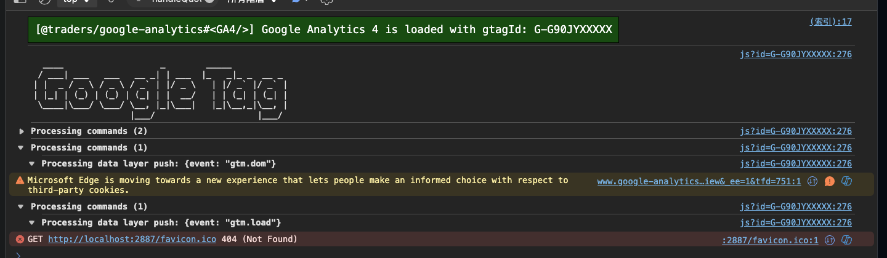
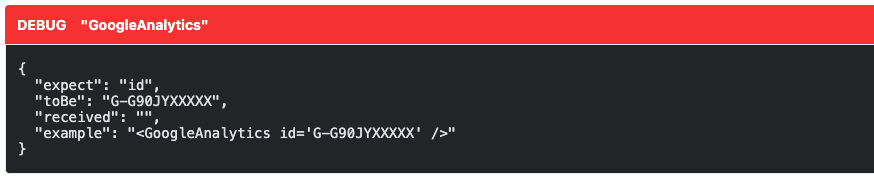

# @aqzhyi/google-analytics

> Google Analytics (GA4) library

## Install

```
pnpm i @aqzhyi/google-analytics
```

## `<GoogleAnalytics />` (astro-component)

> Insert the GTM (Google Tag Manager) script into the Astro Layout and configure your Google Analytics ID, for example: `'G-G90JYXXXXX'`.

###### pages/_layout/BasicLayout.astro

```astro
---
import { GoogleAnalytics } from "@aqzhyi/google-analytics"
---

<!doctype html>
<html>
  <head>
    <GoogleAnalytics id='G-G90JYXXXXX' />
  </head>
  <body>
    <slot />
  </body>
</html>
```

###### pages/index.astro

```
---
import BasicLayout from "./_layout/BasicLayout.astro"
---

<BasicLayout>
  Page 1
</BasicLayout>
```

###### Preview



## `<GoogleAnalytics debug />` (astro-component)

```astro
<GoogleAnalytics
  id=''
  debug={true}
/>
```


